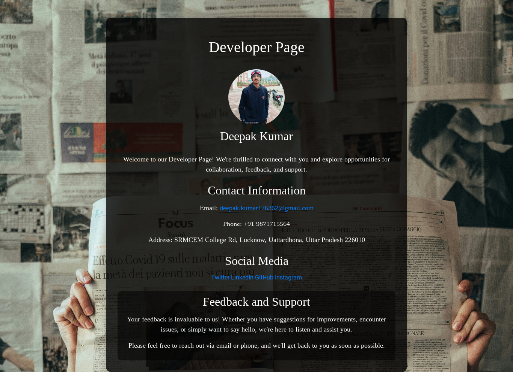

# **News Extraction and Analysis Web Portal** 📰✨

## **Overview**
This web application extracts news articles from *The Times of India*, analyzes the text, and provides key insights such as sentiment analysis, keyword extraction, and a concise summary. The portal aims to save users time by eliminating distractions like advertisements while offering meaningful insights into societal trends.

## **Motivation**
- Simplify reading news by summarizing articles.  
- Provide quick insights into societal trends using text analysis.  
- Predict hate speech or positive sentiments in society.

---

## **Features**
- Extracts and analyzes news articles from URLs.  
- **Sentiment Analysis**: Evaluates the tone of articles.  
- **Text Insights**: Provides word count, sentence count, and keyword extraction.  
- **Short Summaries**: Summarizes lengthy articles into digestible snippets.  
- **User Account System**:  
  - Non-logged-in users: 2 free prompts with limited analysis.  
  - Logged-in users: Unlimited prompts and detailed analysis.  
  - Admins: Access to database insights and user data.  
- **Google Login Integration**.  
- User history tracking for revisiting previous analyses.

---

## **Tech Stack**
- **Frontend**: HTML, CSS, minimal JavaScript  
- **Backend**: Python (Flask framework)  
- **Database**: PostgreSQL (Hosted on Render)  
- **APIs and Libraries**:  
  - `BeautifulSoup` for web scraping  
  - `NLTK` for text preprocessing and keyword extraction  
  - `TextBlob` for sentiment analysis  
  - `summa` for text summarization  
  - `google_auth_oauthlib` for Google OAuth 2.0 integration  

---

## **Methodology**
1. **URL Extraction**: Extract HTML content using `urllib` and `requests`.  
2. **Web Scraping**: Scrape news articles with `BeautifulSoup`.  
3. **Data Preprocessing**: Clean data via tokenization, stopword removal, and stemming using `NLTK`.  
4. **Text Analysis**: Perform keyword extraction, sentiment analysis, and summarization.  
5. **Database Integration**: Store articles and analysis results in a PostgreSQL database.

---

## **How to Use**
### **Installation**
1. Clone the repository:  
   ```bash  
   git clone https://github.com/Deepak-kumar2004/New_Extractor_Web_App.git  
   cd New_Extractor_Web_App  
   ```  
2. Install dependencies:  
   ```bash  
   pip install -r requirements.txt  
   ```  
3. Configure the `.env` file with your database and API credentials.  

### **Run the Application**
1. Start the Flask server:  
   ```bash  
   python app.py  
   ```  
2. Open your browser and navigate to `http://localhost:5000`.  

---

## **Screenshots**
- **Home Page (Non-Logged-In Users)**  
    
- **Result Page without Login**  
    
- **Home After Login Page**  
    
- **Developer Page**  
  
- **Result Page with Text Analysis**  
   
- **Admin Interface**  
  
- **Databse View for Admin**  
  
- **User Details**  
   


---

## **Future Enhancements**
- Expand to support multiple news sources.  
- Add multilingual article analysis.  
- Incorporate advanced visualizations and dashboards.  
- Enhance user personalization for news recommendations.

---

## **References**
- ChatGPT for Google Authentication guidance and error resolution.  
- Various Python libraries for data scraping and analysis.

---

## **Live Demo**
- [Web Application](https://new-extractor-web-app.onrender.com)  

## **License**
This project is licensed under the [MIT License](LICENSE).
